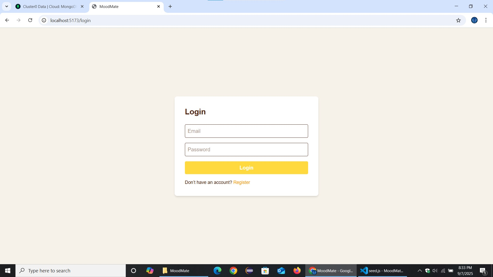
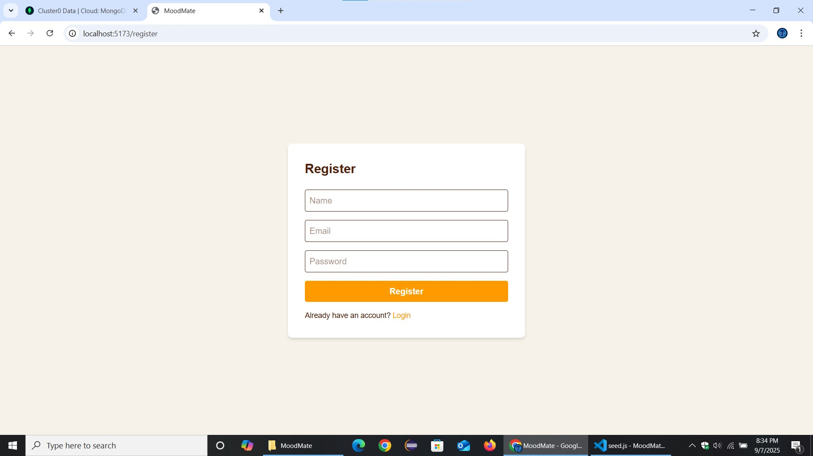
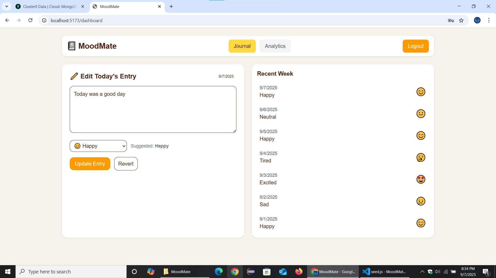
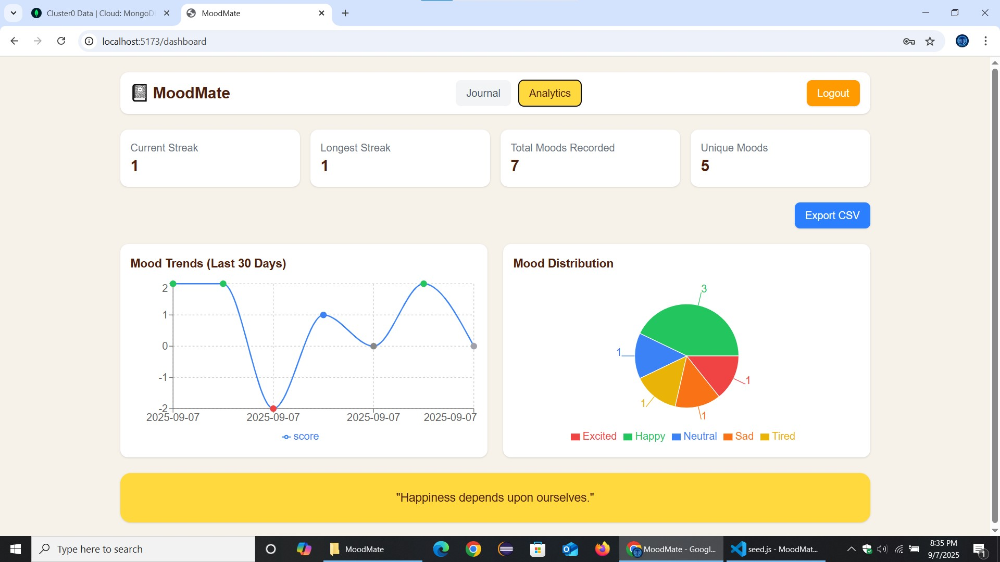

# 📕 MoodMate  

MoodMate is a personal mood tracking and journaling web app.  
It helps you **log daily moods**, **track emotional trends**, and **visualize your mental health journey** with streaks, analytics, and motivational quotes.  

🔗 **Live Demo:** [MoodMate](https://mood-mate-khaki.vercel.app)  

---

## ✨ Features  
- 📓 **Daily Journal** – Write your thoughts & feelings.  
- 🙂 **Mood Logging** – Select your mood via dropdown.  
- 📊 **Analytics Dashboard** –  
  - Mood Trends (Line Chart)  
  - Mood Distribution (Pie Chart)  
  - Streak Tracker (Current & Longest streaks)  
  - Quick Stats (Total moods, unique moods)  
- 💡 **Motivational Quotes** – Get a daily boost.  
- 📤 **Export to CSV** – Download your mood data for offline tracking.  

---

## 🛠️ Tech Stack  
- **Frontend:** React (Vite), TailwindCSS, Recharts  
- **Backend:** Node.js, Express.js  
- **Database:** MongoDB Atlas  
- **Auth:** JWT Authentication  
- **Deployment:**  
  - Frontend → [Vercel](https://vercel.com/)  
  - Backend → [Render](https://render.com/)  

---
## 📸 Screenshots  

### Login   
  

### Register  
 

### Journal Page  
  

### Analytics Page  
  

